# Application Studio AI Architecture

## User promise

Application Studio turns a natural-language request into a reviewable set of CV changes for the job currently open in the studio. It should understand requests such as:

- `Change my portfolio URL to https://example.com.`
- `Make the introduction more apt for this job description.`
- `Rewrite SageCare to emphasise the most relevant product experience.`
- `Change every location to London except the three Singapore entries.`
- `Tailor the whole CV for this role, but leave Krislite unchanged.`

CareerOS must change only the intended fields, preserve exact values where the user supplied them, avoid inventing candidate facts, and show proposals before changing the draft.

## CV knowledge model

CareerOS does not treat a CV as one text blob. The shared `CvDocumentContent` schema gives the AI and editor the same structure.

### Document fields

- Name
- Headline
- Introduction or profile summary
- Contact email
- Contact phone
- Portfolio or website URL

### Section groups and entries

Entries sit inside groups such as Education, Professional Experience, Leadership and Activities, Projects, Awards and Achievements, and Skills. Each entry has a stable ID and may contain:

- Title
- Subtitle
- Date
- Location
- Content
- Evidence type
- Source evidence IDs

The group is the CV heading. The entry is the school, role, project, award, or skill block within it. A request can target a whole document field, one entry, one field inside an entry, several named entries, or the complete eligible CV.

### Job context

The open Application Studio supplies the selected posting's title, company, summary, full description, required and preferred requirements, and other structured job fields. Job context controls relevance and emphasis. It is not evidence that the candidate possesses a skill.

### Candidate evidence

Imported CV and portfolio evidence is stored with stable evidence IDs. Proposed factual wording must cite those IDs and remain supported by the cited source text or the existing target content. Employer requirements cannot be converted into candidate claims.

## Request pipeline

```mermaid
flowchart LR
  A["User request"] --> B["Exact or qualitative classification"]
  B --> C["CV scope resolution"]
  C --> D["Trusted target plan"]
  D --> E["Evidence-grounded generation"]
  E --> F["Schema and safety validation"]
  F --> G["Reviewable proposals"]
  G --> H["Accept or reject"]
  H --> I["Autosaved draft"]
  I --> J["Immutable snapshot and PDF"]
```

### 1. Classify the requested operation

CareerOS separates two request types before generation:

- **Exact replacement:** the user supplied the final value, such as a URL, email, phone number, name, location, or quoted sentence. CareerOS preserves that value exactly.
- **Contextual transformation:** the user supplied an objective, such as `make it more relevant`, `tailor`, `rewrite`, `shorten`, or `align with the job`. The instruction is not treated as replacement CV text. The AI writes the proposed result.

This distinction fixes the previous failure where `make it more apt for the job description` was incorrectly interpreted as the literal introduction value.

### 2. Resolve scope

CareerOS first resolves clear concepts and identifiers using the CV schema:

- `intro`, `profile`, and `profile summary` map to the introduction field.
- Contact concepts map to email, phone, or website.
- Entry-field concepts map to title, subtitle, date, location, or content.
- Named entries are matched against their title, subtitle, aliases, and stable IDs.
- `all` or `every` requests construct a complete target set and subtract explicit exceptions.

When the wording is ambiguous, dictated, misspelled, or cannot be resolved confidently, a separate semantic planning call maps it to the existing schema. The planner may select only IDs that CareerOS supplied. It cannot create CV content or invent targets.

### 3. Build a trusted plan

The application converts scope into trusted resolved targets. Each target includes its stable key, display label, field type, current content, and owned evidence IDs. Explicit exclusions become protected IDs.

For broad requests, a coverage pass must account for every eligible target as either `change` or `keep`. Missing targets trigger one bounded repair request. A still-incomplete plan fails without returning partial edits.

### 4. Generate changes

The generation call receives:

- The user's original instruction.
- The selected job posting.
- The structured current CV.
- Factual profile evidence.
- The trusted target list.
- Protected entry IDs.

It must return exactly one structured proposal for every trusted target and no proposal outside that scope. Job text guides vocabulary and prioritisation; candidate evidence controls factual claims.

### 5. Validate before display

AI output is accepted only after all of these checks pass:

- Shared Zod and strict JSON schemas parse successfully.
- Target fields and entry IDs exist.
- No proposal falls outside the resolved scope.
- Protected entries remain untouched.
- Multi-target requests have complete coverage.
- Exact user values are preserved exactly.
- `add` versus `rewrite` is derived from the actual current field value.
- Evidence IDs exist and belong to the targeted CV entry.
- New factual claims and relationships are supported by existing content or cited profile evidence.
- Duplicate, contradictory, unknown, or unrelated changes are rejected.

One bounded repair pass is allowed for malformed output or omitted targets. CareerOS does not apply a partial result when repair fails.

### 6. Review and persistence

Validated changes appear in the right-hand proposal panel. They are not part of the CV until the user accepts them. Hovering a proposal previews its affected location; accept and reject decisions are explicit. Accepted changes update the editor draft, which autosaves with revision checks. Undo and redo remain editor operations. Immutable snapshots and PDF export occur separately from autosave.

## Exact versus contextual examples

| Request | Interpretation | Result |
| --- | --- | --- |
| `Set my website to https://zain.dev` | Exact value | Deterministic proposal preserving the URL |
| `Change my intro to "Product engineer focused on reliable systems"` | Exact value | Proposal preserving the quoted sentence |
| `Make my intro more apt for the job description` | Contextual transformation | AI rewrites only the introduction using job relevance and candidate evidence |
| `Make SageCare more technical` | Contextual transformation | AI rewrites only the SageCare entry |
| `Change SageCare and Krislite locations to London` | Exact multi-target value | One London proposal for each resolved location field |
| `Tailor everything except Singapore Police Force` | Broad contextual request with exclusion | Complete coverage plan; the excluded entry is protected |

## Is this RAG?

This is **structured, evidence-grounded generation**, with a retrieval-like context step, but it is not currently vector-search RAG.

The relevant job, current CV structure, and linked profile evidence are retrieved directly from CareerOS's relational records and supplied to the model. Stable IDs bind evidence to exact entries. No vector database, embeddings, or BM25 index is needed for the current document size because the complete relevant CV and job context fit in one bounded request.

Vector or hybrid retrieval may become useful when a profile contains hundreds of portfolio artifacts. It would then select candidate evidence before this same planning and validation pipeline. It would not replace target resolution, schemas, evidence ownership, or user approval.

## Performance and cost

- Exact dedicated-field changes generally require no model call.
- Clear contextual single-target and named multi-target requests generally require one generation call.
- Ambiguous scope or complex `all except` wording may require one planning call plus one generation call.
- Broad requests add a coverage-planning call.
- A repair call happens only when structured output is malformed or incomplete.

This hybrid design keeps routine edits fast and inexpensive while using language understanding where it adds value.

## Failure behaviour

CareerOS fails closed when it cannot prove scope, evidence, or complete coverage. No proposal is applied automatically. Errors should identify whether the failure involved target resolution, protected scope, exact-value preservation, evidence support, malformed output, or incomplete multi-target coverage.

AI run metadata records provider, model, duration, state, operation, and evidenced-change count. Source CV text and secrets are not written to that run log.

## Verification

The AI package regression suite covers:

- Exact dedicated fields without model calls.
- The contextual introduction request `change the intro to make it more apt for the job description`.
- Named single- and multi-entry requests.
- All-except scope and dictated target names.
- Complete broad-request coverage and repair.
- Unknown, unrelated, duplicate, and protected targets.
- Evidence ownership, invented claims, and invented factual relationships.
- Exact multi-target values and operation validation.

## Current limitations

- The semantic planner understands the current structured CV, not arbitrary visual coordinates in an uploaded PDF.
- Evidence retrieval is relational and ID-based; semantic portfolio retrieval is not yet implemented.
- A model can still return malformed or unsafe output, but CareerOS rejects it rather than applying it.
- Highly ambiguous requests may require the user to name the field or entry more explicitly after the bounded repair fails.
- Job context can guide phrasing but cannot justify adding a skill or achievement absent from candidate evidence.

## Primary implementation locations

- AI planning, generation, and validation: `packages/ai/src/index.ts`
- Shared CV and proposal schemas: `packages/contracts/src`
- API orchestration and AI-run records: `apps/api/src/server.ts`
- Application Studio proposal review and editing: `apps/web/src`
- Regression tests: `packages/ai/src/index.test.ts` and `apps/api/src/ai.test.ts`
